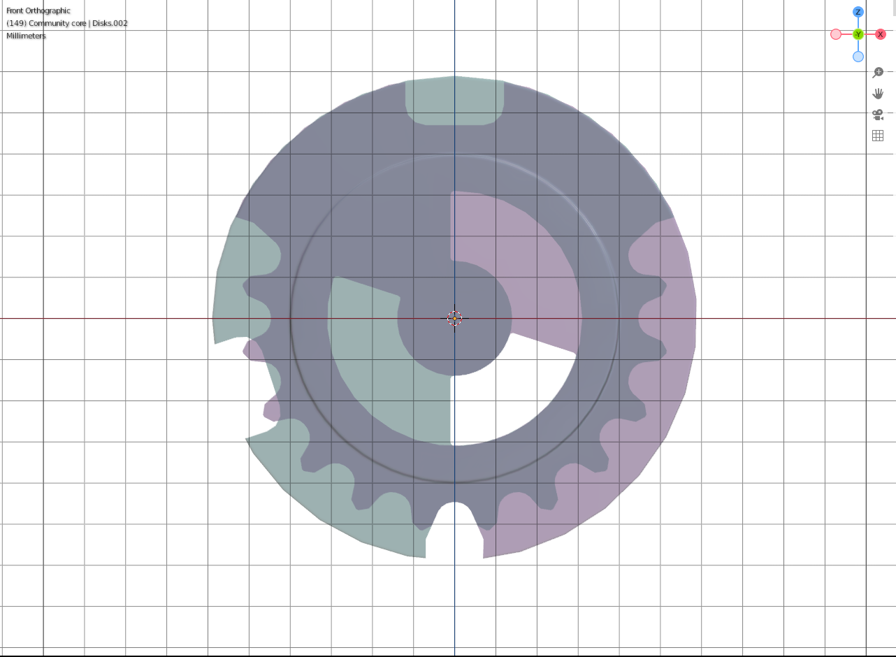
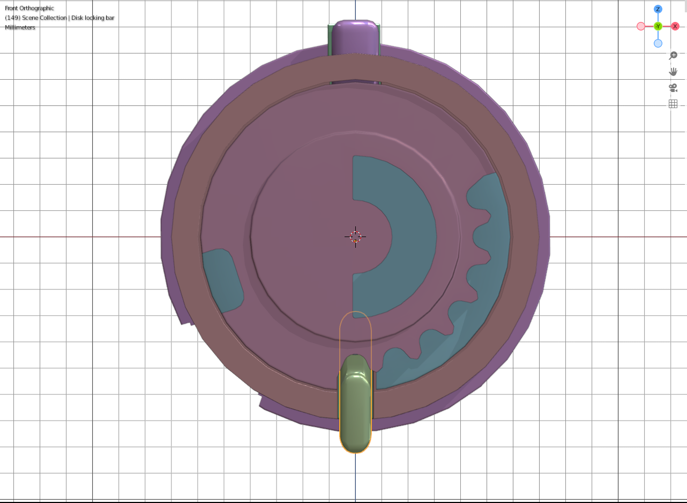
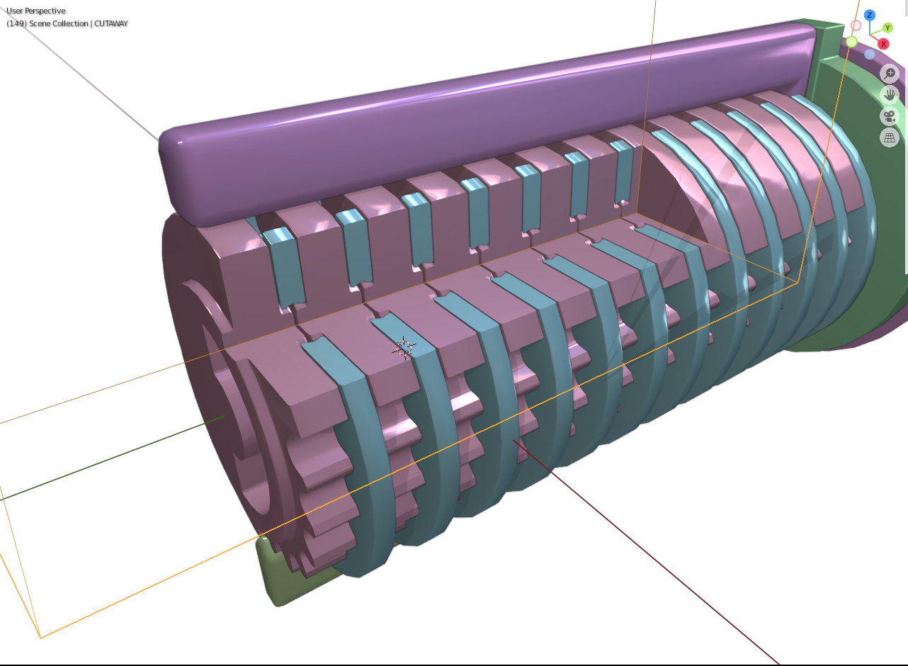
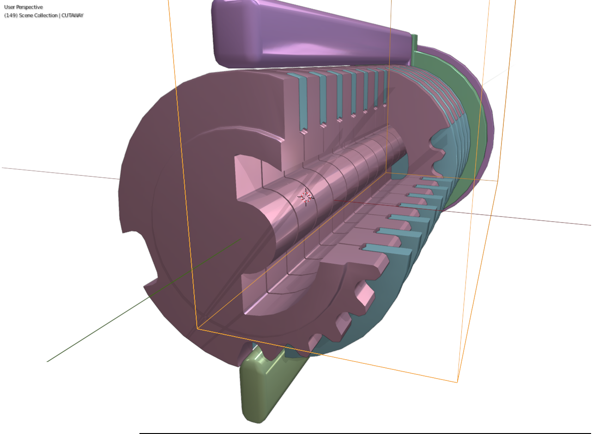
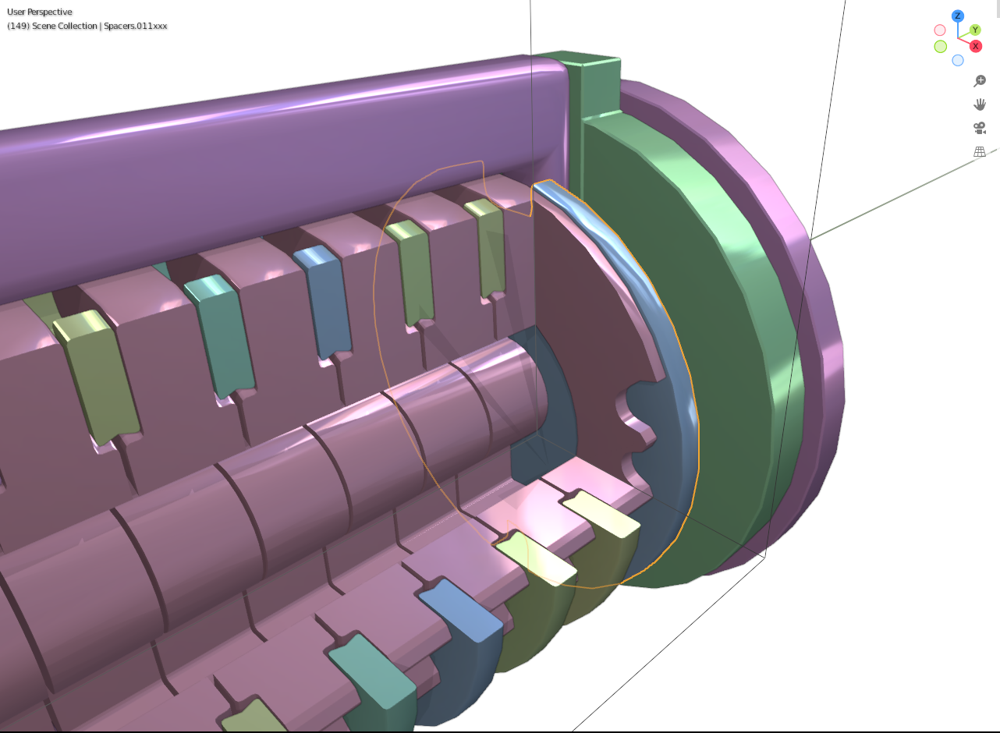
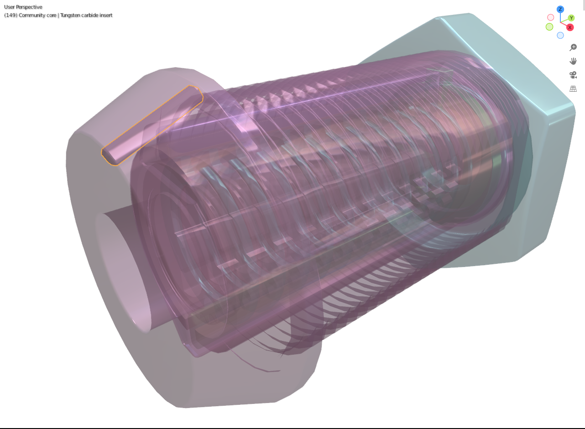
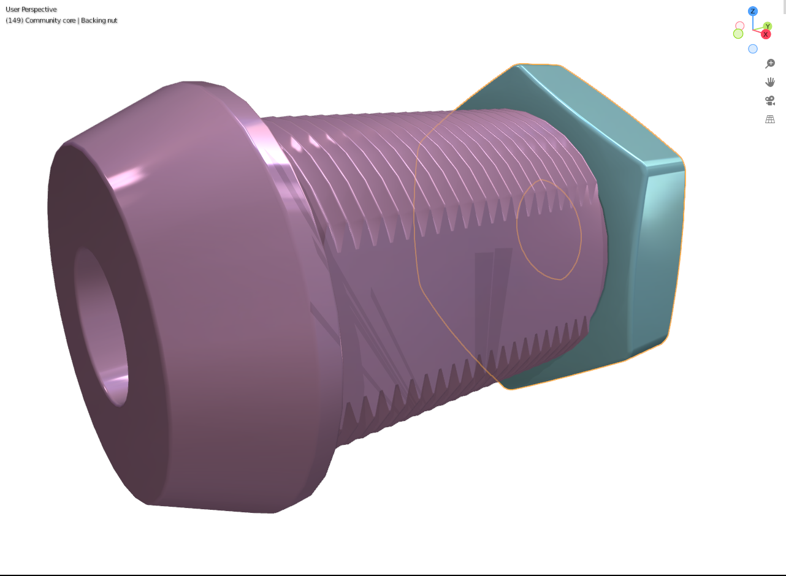
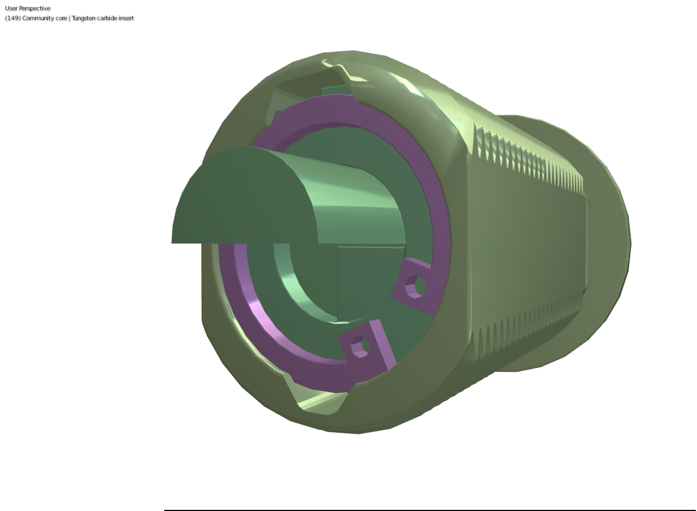

# Community Core lock design

This is a disc detainer lock design with the intent to provide a safe mechanical lock design for anybody to freely manufacture.

This design is licensed with Apache License 2.0 which means that you have to automatically license all interfering patents under your control to anybody using this lock design without a fee. If you don't accept the terms, do not use or distribute the design. See file LICENSE for details.

If you start to manufacture and sell this lock design, I'd be interested to have a copy of your manufactured lock. However, there's no obligation of any kind because this design is free as in freedom.

I'm calling this lock design "Community Core", similar to "Community Pick" developed by Lock Picking Lawyer and Bosnianbill (https://youtu.be/pelD237owcc).

## WIP: Initial release notes

This is still work in progress (WIP) version and is not a ready design yet.

- The naming of the parts uses Abloy style naming: the whole lock body is called "housing" (some other lock designs may call this "cylinder"), the moving part touching the housing is called "cylinder" (some other lock designs may call this "plug") and inside the cylinder are "spacers" (some other lock designs may call these "washers") and "disks" (some other lock designs may call these "tumbler disks" or "detainer disks"). In addition, this document uses wording "code disks" to refer to disks with secret cut positions, namely all other disks but the first and last.
- All the disks have true gates in zero cut position. It should be obvious how to move the gate for each disk if you understand how disk detainer locks work in general.
- I'm not happy with the mechanical strength of this lock; I now think that it would be better to limit the movement of code disks similar to original Abloy Classic design. The reason I avoided that design is that it leaves more space inside the lock and allows more brute force attacks especially when the cylinder is made out of brass. However, that design allows overlapping the cuts and the limiter during the disk movement and doesn't require so much empty space near the disk locking bar area. This initial design uses the disk locking bar as both disk rotation limiter and disk locking mechanism and the extra space needed makes both functions weaker in practice.
- The cylinder rotation limiter needs more work. This design is more like proof of concept. I think something closer to mechanism used in Protec would be okay and should be free of patents, too.

## Short Blender instructions

- Use Blender version 2.93 or newer.
- Click and hold middle mouse button and move mouse to rotate the view.
- Hold Shift and the click and hold middle mouse button and move mouse to pan the view.
- Use mouse wheel to zoom in and out.
- Use Outliner view at the top right of the window to show and hide the parts of the lock. Use the "Eye" icon to hide parts in viewport area to better see the inside of the lock.
- Use small buttons on the top right of the viewport area to toggle the X-ray view or wireframe view to see more details.

# Design

The design of this lock core is based on Abloy Classic design which was originally designed in 1905 and has been commercially sold since 1920 so basic part of the design should be patent free worldwide. The patent system being as broken as it is I cannot know if some part of the design infringes some patent somewhere. This is all my own design except for the Abloy Classic compatible parts.

Key points of the design and differences to original Abloy Classic design and rationale for each change:

- Maximum code disk orientation range has been extended from 0-90 degress to 0-108 degrees. The rationale for this change is to make the "problem 50" documented by Matt "Huxleypig" Smith impossible to sidestep for the attacker. (https://youtu.be/GBaihzVxs5Y?t=1740). In practise, the picker would need to adjust 108 degrees of rotation per disks but the remaining space for the pick movement is 180-108 = 72 degrees. In addition, the circular inner edge requires any flag-like picking tool to reach the edge of the keyhole to successfully turn the disk and this design hopefully prevents any simple picking tool from being successful. 
- In addition to classic sidebar there's another disk locking bar which has narrower cut in the housing forcing it to bind into code disk cuts before the actual sidebar is pressed against the code disks. This prevents rotating the code disks to search for gate positions while applying pressure to sidebar. 
- The code disks and spacers have interlocking profile to avoid decoding attacks that depend on pushing a thin tool between the disks to feel the gates. 
- The code disks are closer to each other in the keyhole to prevent inserting a picking tool that can be rotated in the space between the disks (most Abloy designs have about 0.5 mm space between each disk). 
- There's a filled disk between the end of the keyhole and the cylinder. The intent is to avoid decoding by using thin wire that goes through the keyhole and turns back to the sidebar from the back. For the same reason, the inside of the lock face part of the housing has been shaped to match the spacer profile. 
- A tungsten carbide insert has been added to the front of the housing to make milling attack harder to execute. (https://youtu.be/uj4myR2XlWc) 
- A backing nut has been added to the end of the lock to prevent brute force attack where a punch is used to push all disks out of the back of the lock housing. This nut is not needed for front loading designs that should use similar design to Abloy padlocks (that is, a screwed front with a retainer screw accessible only when lock is open). 
- A regular inner circlip is used to hold the disks inside the lock to make handling the core easier while rekeying the lock. 
- The initial example design is trying to implement something similar to Abloy CL100 cam lock. The example design uses a bit longer housing to add one extra disk and cylinder rotation limiter. And the front of the housing is thicker to add extra protection against physical attacks.

In total, I think this design has 4 additional parts compared to original Abloy Classic design: disk locking bar, one extra filled spacer at the end of keyhole, cylinder rotation limiter and the extra backing nut for the cam lock design.

It should be obvious how to use this same design for padlocks and doors. Practically just copy the housing used in Abloy Classic and add the second groove in the housing for the disk locking bar.

## Additional design points

- This lock's security is strictly based on key cuts. There will be no patents to prevent purchasing key blanks or locks parts. If somebody takes a photo of your key, he or she can manufacture a key copy and open your lock. I wouldn't recommend anybody to use master key system for any locks but if you truly want such thing regardless of lesser security, feel free to add more true gates to discs and follow the master keying hierarchy Abloy did during 1980s. Note that each extra true gate in any disc for master key reduces possible key space in half. For example, two master cuts in one lock reduces key space to 25% of the original. Note that if you want to use profiled keys, only zero cut discs can have anything on the outside curve of the key. For an example of 3D printed keys, see this: https://www.thingiverse.com/thing:4191477
- Because this lock's security is not based on patents, the key will not have any "interactive elements" or "passive elements" which some high security lock manufacturers use just to be able to get patents.
- The lock is designed to use keys similar to Abloy High Profile key blanks but the key size is identical to being cut from steel pipe with 3 mm inner diameter and 6 mm outer diameter. The disk spacing is 2 mm inlucing spacers and key should be cut with a blade that has width between 2.3-2.5 mm. (Note that cutting wheel is partially overlapping cuts on both sides and this is intentional to add some play for the key while moving the disks to open the lock.) My hope is that anybody interested in locks could purchase lots of discs and rekey their locks at will, maybe even using just steel pipe as key blanks to avoid having to disclose the key cut even to a locksmith.
- The housing inside diameter is identical to modern Abloy housing (14 mm inner diameter for the housing). The Abloy Disklock housings which already have 2 sidebar holes should be okay for a proof of concept. Note that the sidebar cut in the housing must be wider than the disk locking cut or the sidebar can be pressed to code disks without locking the disks. It might be possible to use existing Abloy housing with wider disk locking bar and narrow sidebar so force the disk locking bar to activate first.
- At least the first and last disks should be manufactured from hardened steel to avoid drilling attacks and possibly deforming the disks to get sidebar to touch the code disks without locking the disks.
- Disc locking bar is positioned 180 degrees from sidebar to make it harder for attacker to use manufacturing tolerances to move the discs slightly while sidebar is pressing against the discs.
- Use of L-shaped sidebar to prevent extracting the sidebar by drilling a small hole from the front of the lock to the sidebar.
- Both disc locking bar and sidebar have square design to require more exact disc movement to make picking harder. Note that disc locking bar should have better tolerances than the sidebar.
- The sides of the discs have machined surfaces to prevent inserting a tool between discs. Attacker could use such tool to feel the true gates and decode the required key. Note that this requires similar surfaces to the front and back of the core, too, to prevent similar attack before the first disc or after the last disc.
- Increase maximum key cut from 90 degrees to 108 degrees to reduce space available for possible picking tools.
- Add screwable back behind the core to prevent attack that forces all discs trough the lock in case lock has open space behind (e.g. cam lock usage). Note that in case of cam lock using non-round hole, the lock core must be hold with a snap ring because this screwable back can be added only after the lock has been screwed in installation position.
- First and last disk must be rotated with zero cut key and neither disk locking bar or sidebar can touch the code disks before these two disks are fully rotated. This should reduce the available space usable to any picking tools. I also considered tensioning from random disc but figuring out which disc to apply the tension requires only small extra work from the picker and non-zero cut at the tip of the key makes inserting the key harder if discs are not in correct starting position before inserting the key. Note that after discs have been locked, any disc can be used to tension the lock. This also designed to prevent self-impressioning because all discs bind thanks to disc locking bar activating before sidebar.
- Discs are nearly next to each other in keyway to prevent rotating picking heads between discs.
- The parts should be manufactured with 0.1 mm precision to have a good lock. I think having 0.5 mm precision should still end up a working lock but the tolerances would be so bad that tentative attack would be more feasible

# Ideology - why I'm doing this

I'm hoping to create a design that would be freely used by everybody (hence the Apache 2.0 license that has a section about patents). My hope is that if a freely available safe lock design is available, some cheap Chinese manufacturers would start producing better locks instead of poor quality abloy classic clones with square keyhole and zero false gates that they do nowadays. And if the most basic cheap Chinese lock was a secure disk detainer lock in the future, MasterLock and friends would need to take a hint, too. I don't think my design is the best you can do but I think it's the *minimum* you should do.

My personal thinking is that the whole patent system should be stopped immediately because it's no longer for the good of the society as it was originally designed. Now it just hinders innovation. I would just allow copyrighting specific key forms and that should be enough for the needs that Abloy tries to do with their patents – namely preventing anybody else but Abloy from selling key blanks.

As such, my plan is to publish the design without patents and without costs. As a result, I have to accept that Abloy will not use it because of Apache 2.0 patent clause would require them to allow other people to use their patents. On the other hand, nobody but Abloy can use the squeecing keyway design that's inside the Abloy Easy locks because Abloy owns the worldwide patent. So as a result, *nobody* can manufacture a lock that has all the best parts that I can think of. This is the result of our current patent system and it's just sad.

In long run, I think I'll do two or three designs because patents do not limit personal manufacturing and if/when we have metal 3D printers in the near future (probably way sooner than year 2040 when the Abloy Easy patent has expired) anybody can just print the lock core with the best available parts for themselves. As such, part of my design objective will be about trying to create design that can withstand over-torque attacks even with printed parts (which nowadays use sintered metal which is not as strong as e.g. real hardened steel). In practice this may require making some parts intentionally weak to make the lock fail locked if too much force is applied. Of course, you can always print all parts out of Inconel if you're rich enough.

## Intellectual property rights

Intellectual property (IP) rights generally include copyright, design patents and patents. This design is original design by Community Core developers so the copyright situation is clear: the copyright is hold by the developers but all the information provided by this project is licensed under Apache License 2.0 which grants perpetual, no-charge and royalty-free license (https://www.apache.org/licenses/LICENSE-2.0.html#copyright) and grants a perpetual, worldwide, no-charge and royalty-free patent license from all the developers (https://www.apache.org/licenses/LICENSE-2.0.html#patent). However, developers can only grant licenses on copyright and patents they control so *anybody starting to manufacture this lock may be infringing some yet-unknown patent owned by somebody else*. If you plan to manufacture this lock commercially, we recommend that you do your own patent research first. However, you don't need to ask for permission or pay anything to the authors of this design. Please, read the license for details.

In short, Apache License 2.0 guarantees that all the work by [authors](AUTHORS) is licensed to you no-charge and royalty-free but authors cannot grant IP rights outside their control. Specifically this project has not executed any patent search work to try to locate any possibly design infringing patents. That said, I'm not aware of any infringing patents.

As for the design patents, as the visual design presented here looks similar to [Abloy Profile which has been manufactured since 1977 and its patents have expired in 1999](http://www.lockwiki.com/index.php/Abloy_Profile), it should be pretty safe to assume this design doesn't infringe any non-expired design patents.

## Known infringing patents

None known but this is not a promise that none can exist due the way patent system works. This section will be extended if any known patents appear.

# Development

Want to contribute? Great! First you must agree to the same LICENSE provided to all users of this design. Be warned that in practice, this removes your right to sue anybody using this design interfering any patent under your control currently or in the future. If you don't own patents or do not plan to prevent others from using this design for free, this should not prevent you from contributing to this project.

The actual design is initially done using Blender version 2.93. This project
is trying to provide manifold model suitable for printing the whole lock using 3D printer. Objective is to use non-destructive editing as much as possible, too. My original hope was to use Blender physics engine to simulate key working but it seems that the physics engine rigid body simulation is not accurate enough to correctly simulate the lock working (as of Blender version 2.93).

For technical details about structuring the modeling for easy git merging, see https://blender.stackexchange.com/a/7489/3413 for example.

My hope is that this design can be improved to be safe against picking and bypass attacks and still be cheap enough to manufacture to supersede all pin thumbler and low quality disk detainer locks. I also hope that instead of using purely electronic locks, this kind of mechanical lock design could be used in addition to electronic lock which are often vulnerable to magnets (either to bypass relays or to directly turn or rotate parts that are intented to be moved only by motors controlled by the electronic parts). For a really good lock design, a set of electronic motors would be used to orient the wheels in disk detainer lock so that even if you can bypass the electronic controller, you would still need to pick the disk detainer core using electric motors or magnets.

Hopefully we'll get multiple manufacturers creating interchangeable parts in the long run.

If you think that the locks we commonly use are good already, see this for extra information: https://youtu.be/7Lsm4l3mRqw

## Open questions

- Is the 180 degree separation for sidebar and disc locking bar really worth it? Using say 140 degrees would allow having more metal on both sides of the sidebar which should reduce brute force (as in torque) attacks.
- Should disc centers to be made intentionally weaker to break under brute force attack (as in torque) instead of allowing forcing the sidebar to crumble the plug.
- Which materials should be used? Hardened steel for all parts would be an obvious solution but that would increase manufacturing costs compared to e.g. brass. Which parts are safe to be made with cheaper materials? Is it okay to use plastics for any parts? If any other material is used, how to prevent corrosion due electrochemical reactions from metal pairs?
- Should the lock have some kind of mechanism to lock the discs when key has been removed? This will not affect the safety of the lock but may improve usability in practice because the key is easier to insert.
- Should front face have e.g. tungsten carbide inserts to prevent milling cutter attack? High speed steel is obviously a cheaper choice but can it prevent milling cutters?
- Should center of the discs be made intentionally weaker to prevent brute force (as in torque) by rotating the discs regardless of sidebar status?
- Are Abloy Classic / High Profile style keys ok? In practice, those keys have lots of sharp angles and are not that pocket friendly.
- Would it be better to use Abloy Classic style instead of Abloy Profile like keyblanks? Note that the current key diameter matches Abloy Classic but removes the center to make picking tool harder to manufacture (and it also makes it harder to reach the edge of the disk that's deep cut behind zero cut disk).
- Tip of the original Abloy key is wider than all the normal cuts. Should this design be compatible with existing Abloy keys? Currently the tip is 2 mm wide as is every disk after that. It's my understanding that Abloy used longer zero cut section to make it easier to fix scrabled disks when the lock doesn't prevent disk rotation when key is away from the lock.
- Is it still possible to do self-impressioning attack even though disk locking bar tries to keep the disks locked to each other? Would it make a difference if sidebar and disk locking bar are 180 degrees or 90 degrees from each other?
- The key dimensions of 3 mm inner diameter, 6 mm outer diameter have been selected to allow for pretty strong keys when manufactured from steel. Using 4 mm inner diameter would make manufacturing picking tools even more difficult due material strength limitations but would probably make keys too weak for daily usage. With current dimensions it's possible to insert curved flag-like pick through the 72 degree section and still fully reverse a disk in back. With 4 mm inner diameter that wouldn't be possible.
- Is the half ring keyhole actually increasing the security in reality? Square keyhole with reversible key would be easier to use and would probably be less prone to tear holes in your pockets.
- Would it be better to orient the sidebar and disk locking bars 90 degrees from each other? In that case the force applied by the disk locking bar wouldn't press against the sidebar. However, there would be 270 degree area without direct support other than code disks touching the inside of the cylinder.
- Would it be better to have roughness or even small teeths in disk locking bar surface of the disks? The idea of such design would be to make it harder to feel anything from the actual sidebar in case the disk can be moved slightly while locked due manufacturing tolerances.
- Should the sidebar be slightly thinned for the portion of actual code disks? That would make it sure that manufacturing tolerances cannot make it possible to feel the code disk grinding against the sidebar while the disks are not locked (because the first and last disks are able to keep the sidebar from touching the code disks).
- Should there be more free space between the disks to allow more wear and tear? Is it possible to implement this without leaving space for the picking tip to rotate?
- Is this lock design still vulnerable to fast destructive method using high torque? Example attack: https://youtu.be/CNzWrEujKQw
- Would it be a good idea to implement wobbly spacer disks similar to one shown by Matt Smith (https://youtu.be/13bKCOfzaZM)? The difference is that because the tension must be removed to rotate the disks with community core design, the idea could actually work.

## Future development idea

Abloy Easy has a nice design where key is hold by two sidebars running in parallel next to key. The hole in all the spacers could be shaped similar to first spacer in the Abloy Easy (a bit like lemon shape) to force the sidebars to touch each other when the first and last disks are rotated. In practice, the sides of the key guiding sidebars could have sawtooth pattern which interlocks in the hole in the middle of the key when the key is turned in the lock. And the top of the guiding sidebars could be extended to small half-ball shaped holes drilled in the housing which prevent turning the lock when key is half-inserted (similar to Abloy Exec locking mechanism but the hold to the key is by using the hole + interlocking sawteeth pattern). However, for my best knowledge Abloy has patented all designs that use moving guide sidebars: https://patents.google.com/patent/WO2020178478A1/en

As patents do not prevent personal manufacturing, a design that can be printed using metal 3D printer would be nice to have.

I think that the half-pipe keyhole shape in this design is at least as safe as the square keyway profile used in Abloy Easy. However, the half-pipe keyhole has worse usability and the key is slightly harder to insert into the lock.

# Known theoretical methods to attack this design

- Brute force: with default 10 effective discs there are 7^10 or around 280 million possible combinations. Because the rear disc must be moved for each try to open the lock, the material stress for automated testing of combinations should require replacing picking tools during the brute force testing. Assuming that 10 combinations can be tested per second, brute force method should have 50% change of opening the lock after about 160 days and all combinations can be tested in under a year. This should be more than enough for any mechanical lock needs.
- Possible tentative attack #1: when disc lock is activated and sidebar is slightly pressed, tolerances probably allow moving discs a little bit even when disk locking bar is activated. This is probably enough to test if a disc is uncut or has true or false gate at the sidebar. It's still unknown if the disks can be efficiently turned to repeatedly test the disks without needing to set all disks again from back to front for each test. The best pick I can think of would be to use half of 6 mm outer diameter and 5 mm inner diameter steel pipe with code disk locations cut to max depth as tensioning tool, use flag-like picking tool to turn the code disks using the space between the tensioning tool and inside surface of the keyhole. I think this attack is hard to implement because maximum difference between two disks next to each other is 108 degrees and the case where the disk closer to back needs to have max depth cut and next disk closer to opening is zero cut, the max depth cut disk cannot be rotated without moving the closer disk first. Also note that all code disks must be first set to correct orientations before first and last disk can be turned to max rotation to avoid disk locking bar from stopping the actual code disks. To make this attack harder to execute, the discs should have many false gates but there should be enough uncut disc surface to prevent going to false gate depth too easily. With 3 uncut parts on each active wheel, the attacker should have (4/7)^9 or 0.6 % change to have all discs on true or false gate on first try. Because sidebar must be released to rotate the discs locating the false gates should be pretty hard. Once all discs have been rotated to false or true gates, the key will rotate slightly more which will allow detecting this situation. After that, locating more true or false gates per discs is easier because one disc can be changed at a time. Note that disc locking bar must have less tolerance than the sidebar to prevent feeling the sides of the sidebar touching the notches. Also note that the surface of the sidebar and code disks should be as smooth as possible to make it harder to detect if a disk is grinding on sidebar. In optimal case the grinding against cylinder inside and disk locking bar is much higher than the grinding between the disk and sidebar.
- Possible tentative attack #2: ???

# Additional information about disc detainer locks

- Generic info about mechanical locks: Black Hat Locksmithing - SHA2017 - Matt Smith: https://youtu.be/6poAidpNEAc
- Generic info about disk detainer locks by Bosnianbill: https://youtu.be/rMIEPkaadq0
- Adventures in Discworld - OzSecCon 2018 - Matt Smith: https://youtu.be/GBaihzVxs5Y
- Generic info about picking mechanical locks with tentative method by Schuyler Towne: https://youtu.be/JdpP7yPY4ls
- We need to start attacking Disc Detainer locks. Shmoocon Firetalks 2011: https://youtu.be/nT0PDQUZi74
- https://toool.nl/Publications - Han Fey articles about Abloy all locks manufactured before 2006.

## Abloy Classic measurements (official numbers unknown)

- Code disk diameter: 11.8 mm
- Cylinder inside diameter: 11.9 mm
- Cylinder outside diameter: 14.0 mm
- Housing inside diameter: 14.1 mm
- Flat sides of CL100 housing (meant to prevent rotating the lock body): 16.0 mm
- Thickness of the housing at sidebar: 1.5 mm
- Sidebar cut depth in housing: 1.0 mm
- Sidebar diameter 1.5 - 2.0 mm?
- The cylinder is also called as plug or carriage in various sources.
- Abloy classic key width: 6 mm

# Special thanks

- Lock Picking Lawyer and Bosnianbill for making lock picking videos both interesting and funny, and creating the Community Pick (or "The pick that Bosnianbill and I made").
- Han Fey for documenting many Abloy cores in https://toool.nl/Publications
- Matt "Huxleypig" Smith for documenting vulnerabilities of many locks, including disk detainer locks publicly.
- Tarehjerne for creating a very clear video about Protec 2 (https://youtu.be/6zVSJ_wauwg) and providing info about disk detainer locks in general.
- idanhurja for publishing lots of information about modern Abloy locks including publicly showing the picking tip he used for Protec 2 (https://youtu.be/AsG90UGRTpw) and documenting the similarities and differences of Exec and Easy: https://youtu.be/bH5936vuLlY and https://youtu.be/AEXP4zczivM
- Schuyler Towne for publishing easy to explanations about picking locks with tentative method in general.

